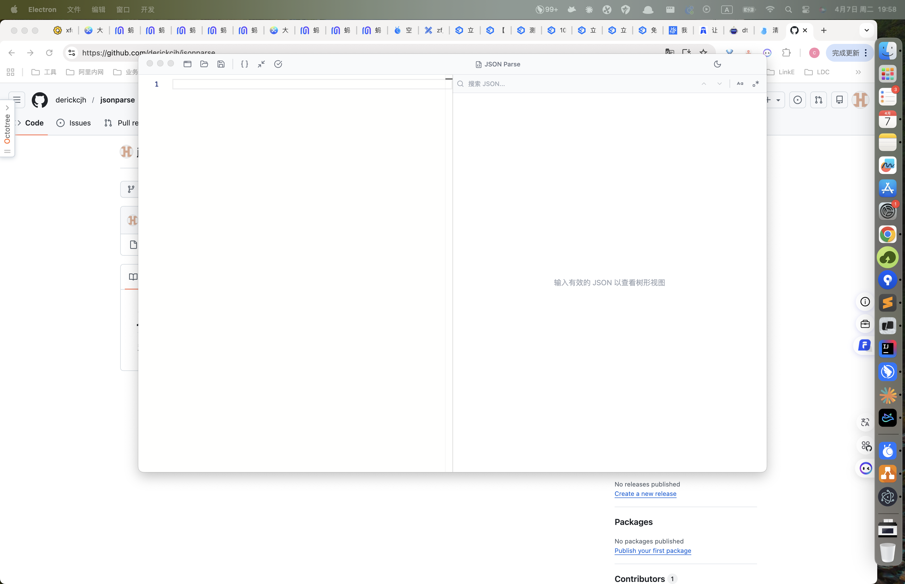

# JSON Parse

一款基于 Electron + React 的 macOS 桌面 JSON 编辑器，支持大数据量 JSON 的高性能解析和可视化编辑。



---

## 功能特性

### 1. JSON 代码编辑器（左侧面板）
基于 Monaco Editor，提供专业级的 JSON 编辑体验。

- JSON 语法高亮
- 实时语法错误提示（红色波浪线标记）
- 括号配对高亮
- 自动缩进
- 行号显示

> 在左侧编辑器中输入或粘贴 JSON，右侧树形视图会实时同步更新。

### 2. 可编辑树形视图（右侧面板）
虚拟化渲染的树形结构，支持 10 万+ 节点流畅滚动。

- **展开/折叠** — 点击箭头展开或折叠节点
- **展开全部/折叠全部** — 树形视图顶部按钮一键操作
- **节点类型着色** — 字符串(绿色)、数字(蓝色)、布尔(橙色)、null(灰色)
- **子节点计数** — 对象显示 `{N keys}`，数组显示 `[N items]`

### 3. 节点增删改

#### 编辑节点
悬浮在节点上，点击铅笔图标进入内联编辑模式，可修改 key、value 和类型。

#### 添加子节点
悬浮在 object/array 节点上，点击 `+` 图标添加子节点，支持两种模式：

- **表单模式**（默认）— 逐字段填写 key、选择类型、输入 value
- **JSON 文本模式** — 点击 `{ }` 按钮切换，直接粘贴/编写完整的 JSON 文本（如 `{"name":"test","items":[1,2,3]}`），按 `Cmd+Enter` 保存

#### 删除节点
悬浮在节点上，点击垃圾桶图标删除。

> 所有树形视图的编辑操作会实时同步回左侧代码编辑器。

### 4. 复制功能

| 操作 | 说明 |
|------|------|
| 鼠标选中 + Cmd+C | 自由选中 key 或 value 文本进行复制 |
| 双击 key | 复制 key 名称，显示 "copied" 提示 |
| 双击 value | 复制 value 值（对象/数组会复制格式化后的 JSON） |
| 悬浮 → 复制路径按钮 | 复制 JSON Path（如 `$.data[0].name`） |
| 悬浮 → 复制 key:value 按钮 | 复制完整的 `"key": value` 格式 |

### 5. 格式化 / 压缩 / 校验
工具栏提供一键操作：

- **格式化**（`{ }` 图标）— 美化 JSON，2 空格缩进
- **压缩**（最小化图标）— 移除所有空白，输出单行 JSON
- **校验**（勾选图标）— 验证 JSON 合法性，显示成功/错误 toast 提示

### 6. 搜索 / 过滤
右侧面板顶部搜索栏：

- 输入关键词实时搜索 key 和 value
- 匹配节点黄色高亮
- `Enter` / `Shift+Enter` 在匹配结果间跳转
- 支持**区分大小写**和**正则表达式**模式切换

### 7. 暗色 / 亮色主题
工具栏右侧的太阳/月亮图标一键切换，默认跟随系统偏好。

### 8. 文件操作
- **打开文件** — 工具栏文件夹图标，打开本地 `.json` 文件
- **保存文件** — 工具栏保存图标，导出为 `.json` 文件

### 9. 多窗口支持
- **Cmd+N** 快捷键新建窗口
- 菜单栏 **文件 → 新建窗口**
- 工具栏窗口图标按钮
- 每个窗口独立编辑，互不干扰

### 10. 大数据量优化
- **Web Worker** — JSON 解析/格式化/搜索全部在后台线程执行，不阻塞 UI
- **延迟解析** — 超过 1MB 的文件只解析前 2 层，展开时按需加载子树
- **虚拟列表** — react-window 仅渲染可见行，10 万+ 节点依然流畅
- **防抖同步** — 编辑器输入 300ms 防抖后再解析

---

## 环境依赖

| 依赖 | 版本要求 |
|------|---------|
| Node.js | >= 18.x |
| npm | >= 9.x |
| macOS | >= 12.0 (Monterey) |

---

## 技术栈

| 技术 | 用途 |
|------|------|
| Electron 33 | 桌面应用框架 |
| React 18 | UI 框架 |
| TypeScript 5 | 类型安全 |
| Monaco Editor | 代码编辑器 |
| react-window | 虚拟化列表 |
| Zustand | 状态管理 |
| Immer | 不可变数据更新 |
| Tailwind CSS 3 | 样式 |
| electron-vite | 构建工具 |
| electron-builder | 打包工具 |

---

## 安装与运行

### 1. 克隆仓库

```bash
git clone https://github.com/derickcjh/jsonparse.git
cd jsonparse
```

### 2. 安装依赖

```bash
npm install
```

> 如果 Electron 下载缓慢，可使用镜像：
> ```bash
> ELECTRON_MIRROR=https://npmmirror.com/mirrors/electron/ npm install
> ```

### 3. 启动开发模式

```bash
npm run dev
```

应用窗口会自动打开，支持热更新。

### 4. 构建生产版本

```bash
npm run build
```

### 5. 打包为 macOS .dmg

```bash
npm run package
```

打包产物位于 `dist/` 目录。

---

## 项目结构

```
src/
├── main/                # Electron 主进程
│   ├── index.ts         # 应用入口、菜单、生命周期
│   ├── window.ts        # 窗口创建
│   └── ipc.ts           # IPC 通信（文件操作、新建窗口）
├── preload/             # 预加载脚本
│   └── index.ts         # contextBridge 安全 API
├── renderer/            # React 渲染进程
│   ├── App.tsx          # 根组件
│   ├── components/      # UI 组件
│   │   ├── Toolbar.tsx
│   │   ├── SearchBar.tsx
│   │   ├── SplitPanel.tsx
│   │   ├── editor/MonacoEditor.tsx
│   │   └── tree/        # 树形视图组件
│   ├── store/           # Zustand 状态管理
│   ├── workers/         # Web Worker（JSON 解析、搜索）
│   ├── hooks/           # 自定义 Hooks
│   └── utils/           # 工具函数
└── shared/              # 跨进程共享常量
```

---

## 快捷键

| 快捷键 | 功能 |
|--------|------|
| Cmd+N | 新建窗口 |
| Cmd+Z / Cmd+Shift+Z | 撤销 / 重做（编辑器内） |
| Cmd+C / Cmd+V | 复制 / 粘贴 |
| Cmd+A | 全选 |
| Cmd+W | 关闭窗口 |
| Enter | 搜索下一个匹配 |
| Shift+Enter | 搜索上一个匹配 |
| Cmd+Enter | JSON 文本模式下保存 |
| Escape | 取消编辑 |

---

## License

MIT
